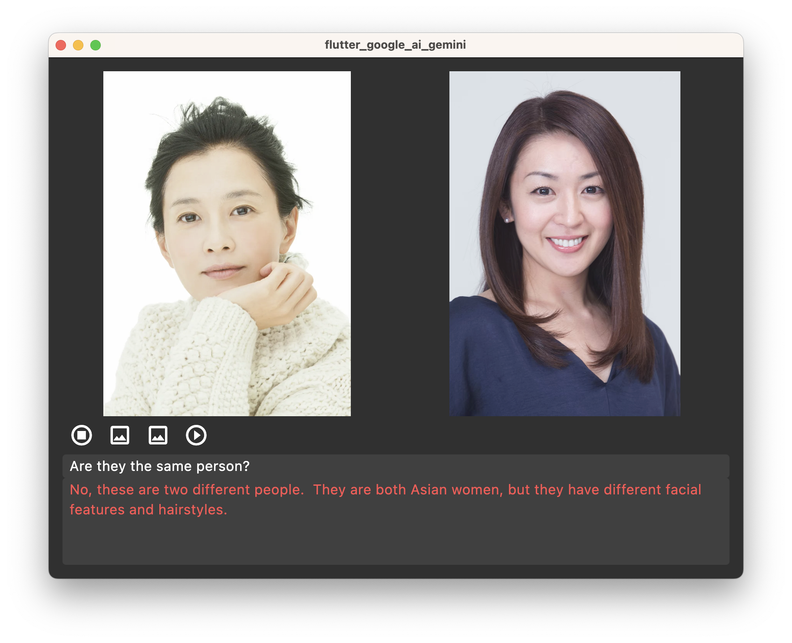
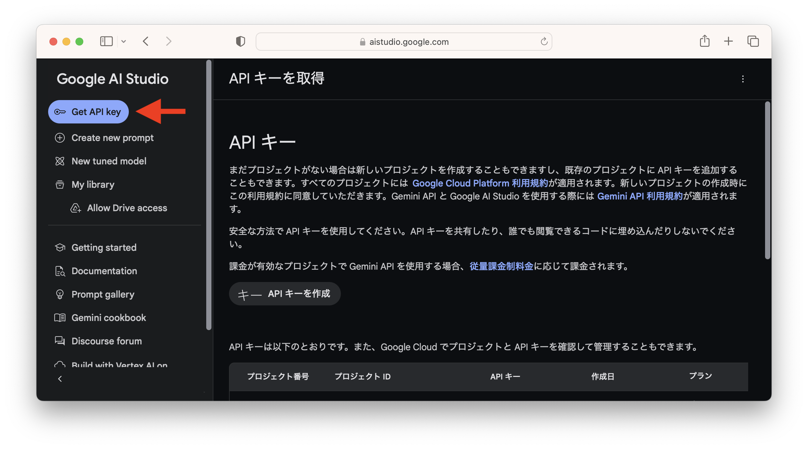

# Flutter Google AI Gemini

## :blue_book: 概要

**開発** Flutter  
**google_generative_ai** 0.4.4 (2024/8)



## :blue_book: Google AI Studio で API key を取得

個人で使う分には無料枠で十分です。  
Gemini 1.5 Flash 無料枠  
15 RPM（１分あたりのリクエスト数）  
100 万 TPM（１分あたりのトークン数）  
1,500 RPD（１日あたりのリクエスト数）  
1 時間あたり最大 100 万トークンのストレージが無料


https://aistudio.google.com/app/apikey

左上にある (Get API key) を押します。  
注意：API_KEY は Github に保存しないでください。

### ソースコードの一部

```
import 'package:google_generative_ai/google_generative_ai.dart';

class _MainScreenState extends State<MainScreen> {
  String prompt = "Are they the same person?";
  File? imageFile1;
  File? imageFile2;

  Future<void> onGenerate() async {
    final model = GenerativeModel(model: 'gemini-1.5-flash', apiKey: apiKey);
    final bytes1 = await imageFile1!.readAsBytes();
    final bytes2 = await imageFile2!.readAsBytes();
    final content = [
      Content.multi([
        TextPart(prompt),
        DataPart('image/png', bytes1),
        DataPart('image/png', bytes2),
      ])
    ];
    final res = await model.generateContent(content);
    setState(() {
      response = res.text ?? 'none';
    });
  }
}
```

### API_KEYをGitに保存しない方法

↓ .env ファイルを作成
```yaml:.env
API_KEY="xxxx-xxxxxxxx-xxxx"
```

↓ pubspec.yaml に追記
```yaml:pubspec.yaml
flutter:
  assets:
    - .env
```

↓ 呼び出し方
```dart:main_screen.dart
  await dotenv.load(fileName: '.env');
  String? apiKey = dotenv.env['API_KEY'];
```


### MAC でエラー

```
flutter: -- ClientException with SocketException: Connection failed (OS Error: Operation not permitted, errno = 1), address = generativelanguage.googleapis.com, port = 443, uri=https://generativelanguage.googleapis.com/v1beta/models/gemini-1.5-flash:generateContent
Application finished.
```

解決方法
macos/Runner/DebugProfile.entitlements に以下を追記してください。

```
<key>com.apple.security.network.client</key>
<true/>
```
